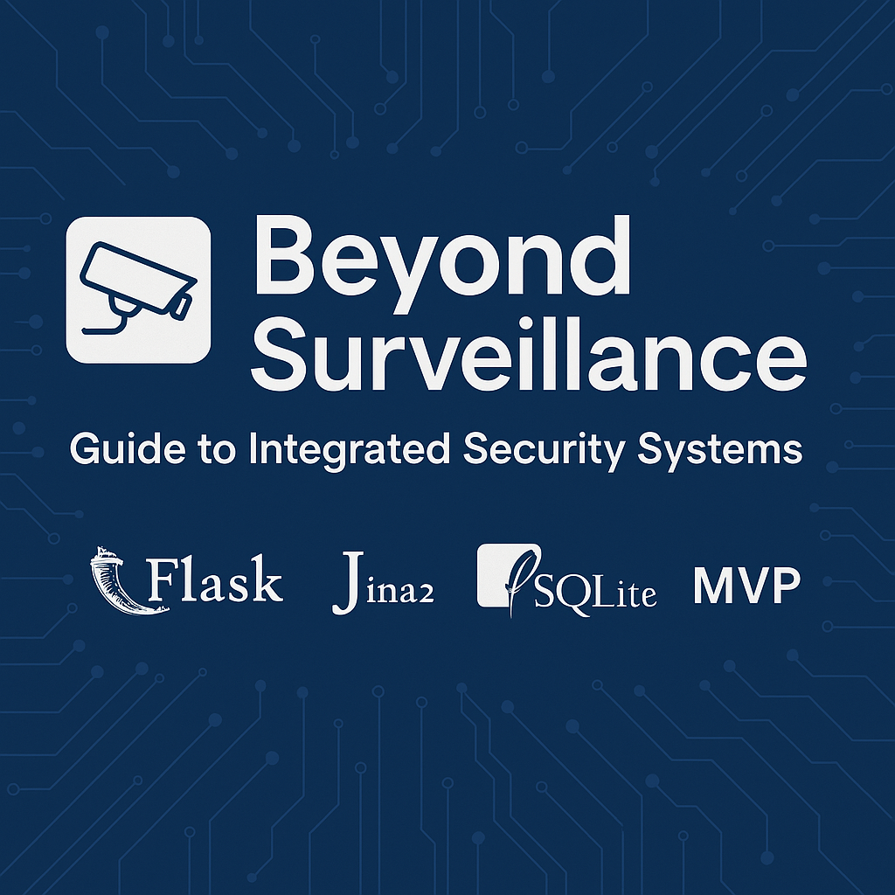

Beyond Surveillance: Guide to Integrated Security Systems
SurveillanceBlog is an MVP blog platform where professionals can share insights on integrated security systems. It allows interaction and engagement through categories, tags, user following, and SEO-friendly features.

💡 Technologies Used
Frontend: HTML5, CSS, Bootstrap

Backend: Python, Flask (Jinja2 templates for server-side rendering)

Database: SQLite (for local development)

Deployment: Render

Security:

	Password hashing using Werkzeug

	CSRF protection with Flask-WTF

📈 Considerations
Scalability: Built using the Application Factory Pattern, making it scalable and maintainable.

Security:

	User authentication and password hashing are implemented.

	Basic input sanitization is in place to prevent SQL injection.

📂 Project Structure

Beyond-Surveillance/
├── SurveillanceBlog/
│   ├── app/
│   │   ├── static/
│   │   ├── templates/
│   │   ├── __init__.py
│   │   ├── main/
│   │   ├── error/
│   │   ├── auth/
│   │   ├── translation/
│   │   ├── cli.py
│   │   ├── email.py
│   │   ├── models.py
│   │   ├── translate.py
│
├── migrations/
├── venv/
├── README.md
├── config.py
├── SurveillanceBlog.py
├── requirements.txt
├── .flaskenv
├── babel.cfg
├── LICENSE

🔨 Installation
Clone the repository:
bash
$ git clone https://github.com/sue2023/Beyond-Surveillance.git
$ cd Beyond-Surveillance/Surveillancelog

Create a virtual environment and activate it:
bash
$ python3 -m venv <venvname>
$ source venv/bin/activate   # On Windows: venv\Scripts\activate
$ pip install -r requirements.txt

Set up the database:
bash
$ flask db init
$ flask db migrate -m "Initial migration."
$ flask db upgrade

Run the application:
bash
$ flask run

📄 License
This project is licensed under the MIT License.

📧 Contact
For any inquiries or contributions, feel free to contact me at susansewe@gmail.com.
